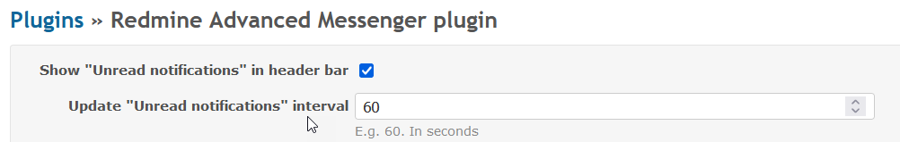
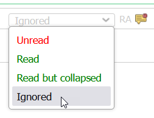
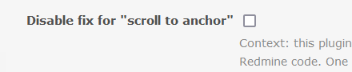

# redmine-advanced-messenger

## Install
This plugin needs the postgres extension ```pg_trgm```, but the instalation of the migration scripts can fail to install this extension because of insufficient rights. 

In this case the ```pg_trgm``` extension should be installed manually by:
1. connecting to the DB as a super user (e.g. ```psql -U postgres redmine```)

2. manually running: ```CREATE EXTENSION pg_trgm;```

## Features in detail

### Show number of notifications in header (auto refreshable)

<details>


The number refreshes automatically. Customizations are possible:



</details>

### `Ignored` status: intended use case

<details>



The **read/unread** status should be **reliable**. Both for the reader (so that he/she knows what notifications he/she still needs to read), and for the writer (so that he/she knows who read the messages).

As a reader, if I **won't read a message**, then I should mark it as `Ignored`. This helps to keep the reliability of the read/unread status. It doesn't matter why I want to explicitly ignore a message. E.g. someone else added me as watcher, so the topic doesn't interest me; or I come after a long absence and I want to "start fresh"; or etc.

Active Redmine users will probably use `Ignored` quite rarely. However, `Ignored` may come handy for occasional Redmine users/collaborators (i.e. they have long absences during which a lot of notifications accumulate).

</details>

### Fix for "scroll to anchor"

<details>

Issues that have a lot of notes (and maybe some of them are collapsed and some not), may lead to imprecise "scroll to anchor". I.e. clicking on a link w/ an anchor (e.g. `https://.../issues/1234#note-117`), scrolls the page, but not precisely to the desired note.

We include a fix for this behavior. It uses a solution that is just a bit hacky. Hence we have an option (+ detailed description) to disable it, for the improbable case of issues that may appear in the future.



NOTE: there is another factor that interferes w/ "scroll to anchor": the fact that Redmine uses ``. If you hit this case, please let us know. We have a fix for this as well, but it's in an internal Redmine plugin of ours.

</details>

### Notes that mention people (e.g. @user)

<details>
Mentioning someone (e.g. @john.doe) in a note does send an email to that person but:
* doesn't add him/her as a watcher,
* and uses a separate email sending mechanism (under the hood, in Redmine).

We did the necessary to capture such emails as well.
</details>

## Minor known issue (regarding back/forward, or duplicate tab), workaround-able w/ page refresh / F5

TLDR: we noticed a strange minor behavior, when doing browser back + forward, or on duplicating tabs. If I just did an Ajax request (e.g. updated the read/unread status), and then click on back + forward, the update is not seen. Workaround: page refresh. It's related to the caching of Ajax requests. Present in all Ajax requests of Redmine; not only in our plugin.

<details>
<summary>Click to expand</summary>

If the read status of a note/forum message is changed, the coloring is changed accordingly. But if we navigate away to another page and after that we navigate back to the initial page (by pressing the back button), the note/message has the old status coloring.

This is caused because, as a response to the server action that update the read_status, we execute a js that updates only the modified note, instead of reloading the whole page. And when we land back on the page, the page is re-rendered from the cache and the journals/messages are having the old read statuses.

This is a pattern also used in Redmine project when a note text is edited. So the problem is present also in that case.

The above happens in Chrome. Not in Firefox. However, the issue is present when duplicating tabs. This seems to affect Firefox as well.

A solution would have been to reload the entire page when changing the read status of only one note/forum message, but that's something we want to avoid.
</details>