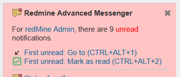

# Featurebook > BottomRightPanelTad.md
Go to [Featurebook > Index](FEATUREBOOK.md)

## TOC

* [`@Scenario` `feature_firstGoTo()`](#feature_firstGoTo)
* [`@Scenario` `feature_firstMarkRead()`](#feature_firstMarkRead)

## Scenarios

<table>
<tr><td> 

`@Scenario` `feature_firstGoTo()` 
</td></tr>
<tr><td>

`First unread: Go to (CTRL+ALT+1)`. Link to the first unread note.
</td></tr>
</table>

<table>
<tr><td> 

`@Scenario` `feature_firstMarkRead()` 
</td></tr>
<tr><td>

`First unread: Mark as read (CTRL+ALT+2)`. 

Jumps to the first unread note. Like clicking on `First: go to`. Sets the status to `Read` (green). 

Puts the whole note w/ a yellow background that will fade out in 5 seconds. This is to visually show where the modification is made. 
Because w/o this, the user won't know exactly what was the note on which the action operated.

These steps are done in AJAX, so no full page refresh. However they need to be performed right away on click (or shortcut). 
And then start the communication w/ the server (which involves a small spinner and some latency). I.e. don't wait for server response to update the screen.
</td></tr>
</table>
