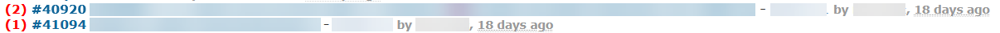

# Featurebook > MyPageTad.md
Go to [Featurebook > Index](FEATUREBOOK.md)

## TOC

* [`@Scenario` `feature_lineDisplay()`](#feature_lineDisplay)

## Scenarios

<a id="feature_lineDisplay"></a>
<table>
<tr><td> 

`@Scenario` `feature_lineDisplay()`<br />
</td></tr>
<tr><td>



Format, e.g.:

```
(1) #1234 Task title - Project by User, 29 minutes ago
```
Format, spec:

```
(unreadNotes) #taskNumber taskSubject - projectName by userName, date
```

* `(unreadNotes)` - bold, link to the issue, scrolled to the latest unread message. Useful when the conversation is fresh, and I want to see directly the latest message (and maybe also reply).
  * red or orange (for the "to process later" variants). The color is different to communicate to the user the fact that there are in fact 2 links, and not one. Hence avoiding to "hide" the feature.
* `#taskNumber taskSubject` - bold, link to the issue; **almost like a** normal link. Useful when I want to have a glimpse of the issue title and description. Then I would use the action `Go to first` or manually scroll. There are a lot of notifications of type "new issue added". This link is perfect for this case.
* `projectName` - link to project
* `userName` - gray, link to the user
* `date` - gray, standard Redmine date rendering (e.g. 15 days ago; on hover => absolute date)

## Explanation for **almost like a** normal link from above.

### Use case

I write a note. Users A and B are notified. I make the note private, and now only user A has the rights to see it.

However, B still sees the link unread note in `My page`. (and on click, he/she is redirected to the issues w/ maybe 0 unread messages)

### Action

When the user clicks an the link (the red or blue), then the system:
  * sees that there are no permissions for that note
  * so it marks the note as "ignored"/gray
  * and even if the link was the red one (i.e. go to the unread notif), the "normal" issue is shown, w/o redirect-to-anchor

### Why this lazy approach?

Lazy i.e. there is the initial phase which is "a bit wrong". But it "self heals" on first click.

For simplicity. An initial version would try to keep the things synchronized. But it was more code. And besides, there are other
scenarios where: at t0 I see note 123. At t1, I don't see it any more. E.g. the permissions for the user are updated.
</td></tr>
</table>
