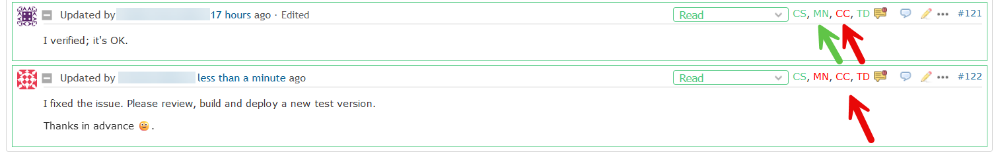
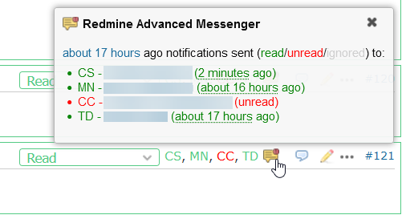
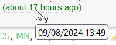
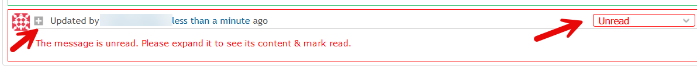

# Featurebook > 01 - Main scenarios.md

Go to [Featurebook > Index](../FEATUREBOOK.md)

`@Scenario:`
## GIVEN an user writes a note (or forum message), WHEN page renders, THEN 1/ the recipients are displayed ...

... AND 2/ one can see who read it and who didn't

In the image above, user CS wrote the note. It was sent to 3 other users. The people (cf. initials) in GREEN => they have read the note. The people in RED => they haven't read (yet).

NOTE: Leveraging feature 1/, after writing a note, it's recommended to **take a look at the list of recipients**. Are they as expected?
* Maybe I was expecting to send the message also to e.g. user XY. But he/she **wasn't a Watcher**. Or I forgot to **mention** `@x.y`. Action: add watcher or mention, and send a new message.
* Maybe I **forgot to check** "private note", so the message was also sent to the clients. Action: edit the note and mark it private.

NOTE: everything working for issue notes also works for forum messages.

Technical note (click to expand)

We hooked into the notification mechanism of Redmine. When it tries to send an email => our code is invoked.

Mentioning someone (e.g. @john.doe) in a note does send an email to that person but:
* doesn't add him/her as a watcher,
* and uses a separate email sending mechanism (under the hood, in Redmine).

We did the necessary to capture such emails as well.

`@Scenario:`
## AND WHEN click on the "yellow callout" icon, THEN a popup w/ detailed info appears

We see again the initials and status (color). Plus user name (clickable) and the time when the message was read. The time is relative, and hoverable for absolute time:

`@Scenario:`
## GIVEN an user receives a note, WHEN page renders, THEN status dropdown shows "Unread" (in red) ...

* ... AND the border of the note is also red,
* AND the note is collapsed,
* AND the text is hidden.

The last bullet is so, to force people to click, and acknowledge the reading of the message. W/o this, especially if the message is short, people might forget this action, hence erode the reliability of the tool.

`@Scenario:`
## AND WHEN click on the "plus" sign (or use the dropdown), THEN the status switches to "Read" (in green), ...

* ... AND the border of the note becomes green,
* AND the note is expanded.

Looking at the first image again:

Starting from now, everybody will see that I have read the message, i.e. my initials will be in green.

NOTE: For an unread message, the following are equivalent: clicking on the "+" sign or switching to "Read" from the dropdown. Usage suggests that using the "+" sign is more natural.
