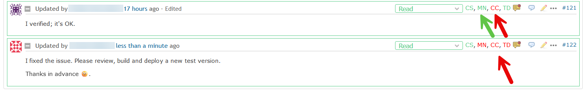
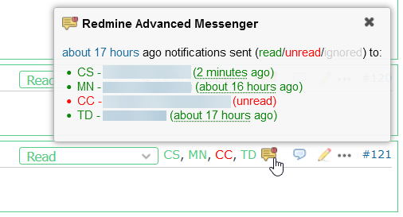
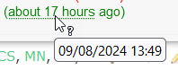

# Featurebook > 01 - Main scenarios.md

Go to [Featurebook > Index](../FEATUREBOOK.md)

<table><tr><td>

`@Scenario` `whenWritesNote()` 
**GIVEN an user writes a note (or forum message), WHEN page renders, THEN 1/ the recipients are displayed ...**
</td></tr><tr>
<td>
      
... AND 2/ one can see who read it and who didn't

In the image above, user CS wrote the note. It was sent to 3 other users. The people (cf. initials) in GREEN => they have read the note. The people in RED => they haven't read (yet).

NOTE: Leveraging feature 1/, after writing a note, it's recommended to **take a look at the list of recipients**. Are they as expected?
* Maybe I was expecting to send the message also to e.g. user XY. But he/she **wasn't a Watcher**. Or I forgot to **mention** `@x.y`. Action: add watcher or mention, and send a new message.
* Maybe I **forgot to check** "private note", so the message was also sent to the clients. Action: edit the note and mark it private.

NOTE: everything working for issue notes also works for forum messages.

Technical note (click to expand)

We hooked into the notification mechanism of Redmine. When it tries to send an email => our code is invoked.

Mentioning someone (e.g. @john.doe) in a note does send an email to that person but:
* doesn't add him/her as a watcher,
* and uses a separate email sending mechanism (under the hood, in Redmine).

We did the necessary to capture such emails as well.

</td></tr></table>

<table><tr><td>

`@Scenario` `whenWritesNote()` 
**AND WHEN click on the "yellow callout" icon, THEN a popup w/ detailed info appears**
</td></tr><tr>
<td>

We see again the initials and status (color). Plus user name (clickable) and the time when the message was read. The time is relative, and hoverable for absolute time:

</td></tr></table>

