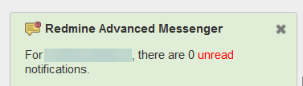

# Featurebook > 02 - Commands in the corner panel.md

Go to [Featurebook > Index](../FEATUREBOOK.md)

`@Scenario:`
## GIVEN there are unread notes, WHEN page renders, THEN a panel is displayed ...

* ... in the bottom left of the issue (or forum) page,
* AND it has a red background,
* AND the number of unread messages is displayed.

The panel is temporarily closeable via the "X" button (for cases when e.g. the popup disturbs because it covers some content). On page refresh, the popup will reappear.

`@Scenario:`
## GIVEN all notes are read, WHEN page renders, THEN the panel is green

`@Scenario:`
## WHEN click on command "Go to first one", THEN the page scrolls to the first unread note

This command appears only if the panel is red, i.e. there are unread notifications.

Technical note (click to expand)

Issues that have a lot of notes (and maybe some of them are collapsed and some not), may lead to imprecise "scroll to anchor". I.e. clicking on a link w/ an anchor (e.g. `https://.../issues/1234#note-117`), scrolls the page, but not precisely to the desired note.

We include a fix for this behavior. It uses a solution that is just a bit hacky. Hence we have an option (+ detailed description) to disable it, for the improbable case of issues that may appear in the future.

NOTE: there is another factor that interferes w/ "scroll to anchor": the fact that Redmine uses ``. If you hit this case, please let us know. We have a fix for this as well, but it's in an internal Redmine plugin of ours.

`@Scenario:`
## WHEN click (or hover) on command "Status for other users", THEN a popup appears ...

... listing the users that have unread messages (including the number of unread messages).

`@Scenario:`
## WHEN click on command "Mark all unread as ignored", THEN a confirmation popup appears, ...

... AND if confirmed, all "Unread" (red) notes will change status to "Ignored" (gray)

This command appears only if the panel is red, i.e. there are unread notifications.
