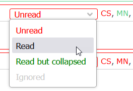
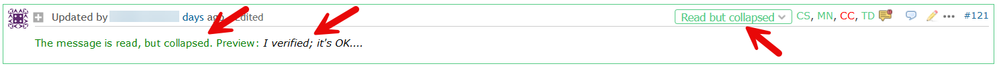
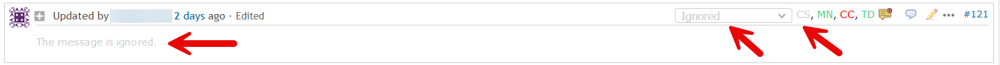

# Featurebook > 03 - Statuses.md

Go to [Featurebook > Index](../FEATUREBOOK.md)

`@Scenario:`
## WHEN click on the "Status" dropdown, THEN the dropdown shows the possible values (colored)

   

At any time, any status can be chosen. E.g. going back from "Read" to "Unread" is possible. 

Actually this might be a technique for reminding: 
* I have read, but I cannot answer now; 
* I switch back to "Unread"; 
* later I will see it and elaborate a longer and precise answer.

The first 2 statuses ("Read", "Unread") were illustrated in the first `.md` file. Further we'll focus on the next statuses.

`@Scenario`
## WHEN the status "Read but collapsed" is selected, THEN ...

* ... the note is considered as read, so its color (border and dropdown) is green,
* AND the "+"/"-" icon displays "+",
* AND the note content is partially hidden: there is an explanatory message + a small portion of the note (unformatted).

This status is a tool to better **organize long discussion threads**. From the perspective of other users, "Read" and "Read but collapsed" have the same meaning.

Regarding the behavior of the **"+"/"-"** button:
* GIVEN status = "Not read" (red) or "Ignored" (gray), WHEN click on "+" (to expand), THEN new status = "Read" (green)

When the status is green, **"+"/"-" toggles** between "Read" <-> "Read but collapsed"
* GIVEN status = "Read", WHEN click on "-" (to collapse), THEN new status = "Read but collapsed"
* GIVEN status = "Read but collapsed", WHEN click on "+" (to expand), THEN new status = "Read"

`@Scenario`
## WHEN the status "Ignored" is selected, THEN ...

* ... the color (border and dropdown) is gray,
* AND the note content is fully hidden.

### Some words about the use case behind "Ignored"

This is a tool to decrement the "unread messages", w/o "lying" about having read the notes.

The **read/unread** status should be **reliable**. Both for the reader (so that he/she knows what notifications he/she still needs to read), and for the writer (so that he/she knows who read the messages).

As a reader, if I **won't read a message**, then I should mark it as `Ignored`. This helps to keep the reliability of the read/unread status. It doesn't matter why I want to explicitly ignore a message. E.g. someone else added me as watcher, so the topic doesn't interest me; or I come after a long absence and I want to "start fresh"; or etc.
