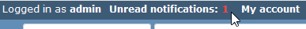
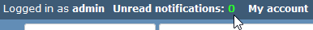
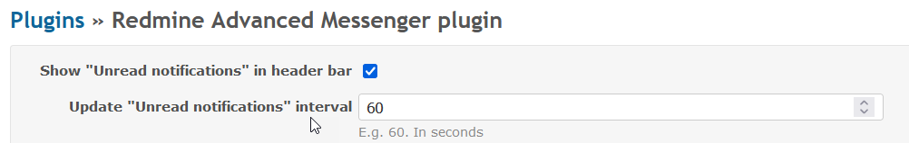
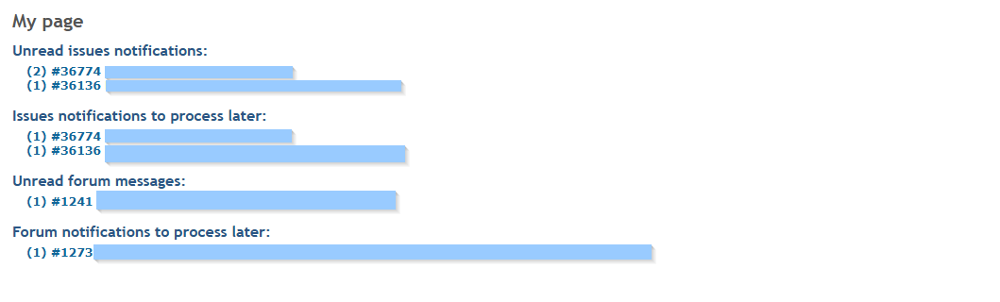
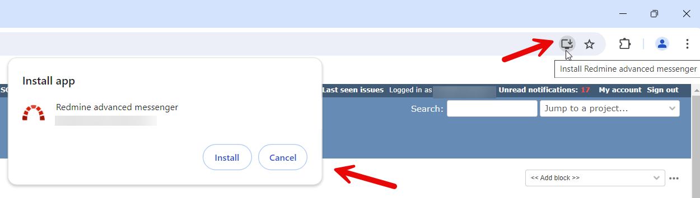
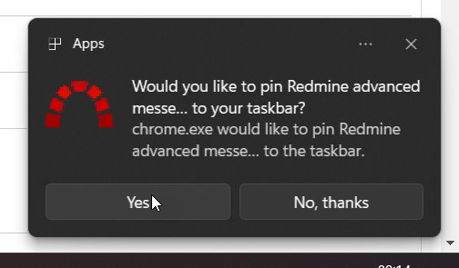
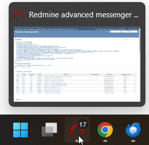
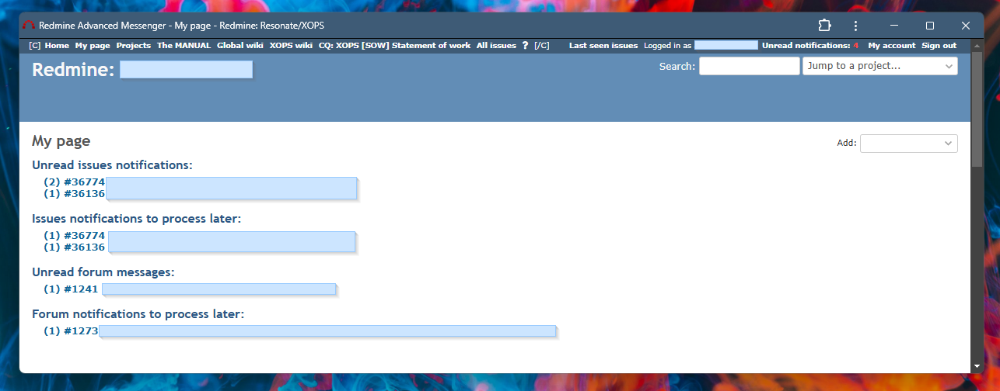
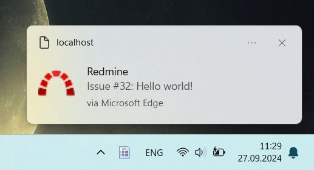

# Featurebook > 04 - My page and related.md

Go to [Featurebook > Index](../FEATUREBOOK.md)

`@Scenario:`
## WHEN page renders, THEN the number of unread notes is displayed ...

* ... in the upper right corner, 
* AND it is colored in red or green (i.e. 1+ or 0),
* AND the number is periodically refreshed,
* AND it is a clickable link, pointing to "My page".

Customizations are possible:

`@Scenario:`
## WHEN "My page" renders, THEN it lists the unread/ read briefly notes and forum posts

* ... in format: number of unread/ read briefly notes for an issue + issue title,
* AND the list entries are links pointing to the first unread note/message from the corresponding issue/forum post,
* AND they are sorted so: most recent note on top.

`@Scenario:`
## WHEN page renders, THEN an "Install" icon appears (i.e. PWA = Progressive Web Application)

This plugin transforms Redmine into a PWA (Progressive Web Application). I.e. it can be installed in the OS just like a native application. The popular browsers support PWAs. 

`@Scenario:`
## GIVEN installed as PWA, THEN the taskbar icon shows a badge w/ the number of unread messages, ...

* ... AND it is refreshed periodically.

Thanks to this feature, we enable near real time communication capabilities. I.e. communicating via Redmine notes is as using a messenger app.

`@Scenario:`
## GIVEN installed as PWA, WHEN click on links, ...

* THEN 1/ they are opened in the OS browser,
* AND 2/ the PWA always shows "My page".

Technical note (click to expand)

  
* For 1/, as there isn't native functionality to support this use case, we use the hack: on click: we modify all the links from the DOM by adding `target="_blank"`.
* For 2/, for most cases, we should be covered by 1/. And there is also a timer that periodically checks that we are still on "My page". And if not => redirect.

`@Scenario:`

## GIVEN installed as PWA, WHEN a new unread note/message, ...

* THEN a notification is displayed,

`@Scenario:`

## GIVEN a notification is displayed, ...

* WHEN the user clicks on the notification,
* THEN it opens a new browser tab that displays directly that note/message.
