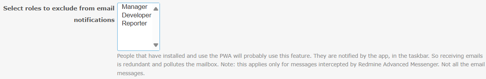

# Featurebook > 05 - Email notification settings.md

Go to [Featurebook > Index](../FEATUREBOOK.md)

`@Scenario:`

## WHEN a notification email is sent and the "Teaser" option is selected in the plugin settings, ...

* THEN the email contains only a short teaser text (100 characters) instead of the full note

`@Scenario:`

## WHEN a notification email is sent and the "Whole note" option is selected in the plugin settings, ...

* THEN the email contains the full content of the note

`@Scenario:`

## GIVEN there is at least one role selected in the multi-select list box in the plugin settings, ...

* AND a user has for the corresponding project a role from those selected in the plugin settings,
* WHEN the user receives a notification that is also intercepted by Redmine Advanced Messenger,
* THEN no email notification is sent

`@Scenario:`

## WHEN no roles are selected in the multi-select list box in the plugin settings, ...

* THEN all users, regardless of their roles, continue to receive email notifications

