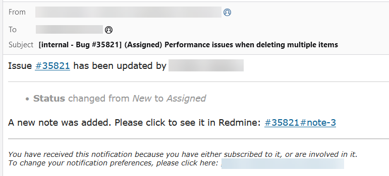
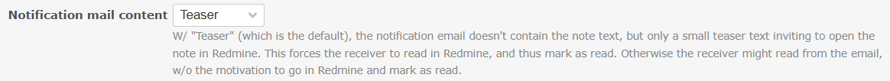
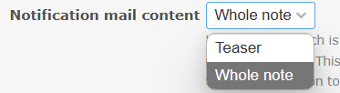
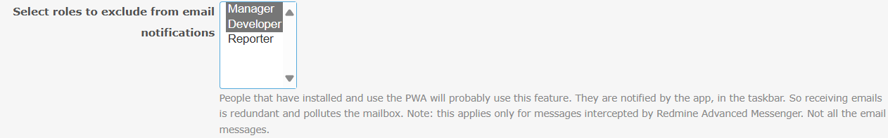
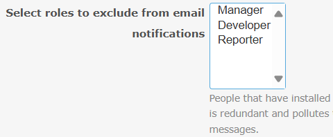

# Featurebook > 05 - Email notification settings.md

Go to [Featurebook > Index](../FEATUREBOOK.md)

`@Scenario:`

## WHEN a notification email is sent and the *Teaser* option is selected in the "Notification mail content" setting, ...

* THEN the email contains only a short teaser text (100 characters) instead of the full note

`@Scenario:`

## WHEN a notification email is sent and the *Whole note* option is selected in the "Notification mail content" setting, ...

* THEN the email contains the full content of the note

`@Scenario:`

## GIVEN at least one role is selected in the "Select roles to exclude from email notifications" setting, ...

* AND a user has for the corresponding project a role from those selected,
* WHEN the user receives a notification that is also intercepted by Redmine Advanced Messenger,
* THEN no email notification is sent

`@Scenario:`

## GIVEN no roles are selected in the "Select roles to exclude from email notifications" setting, ...

* WHEN users receive a notification that is also intercepted by Redmine Advanced Messenger,
* THEN all users, regardless of their roles, will also receive the email notification

